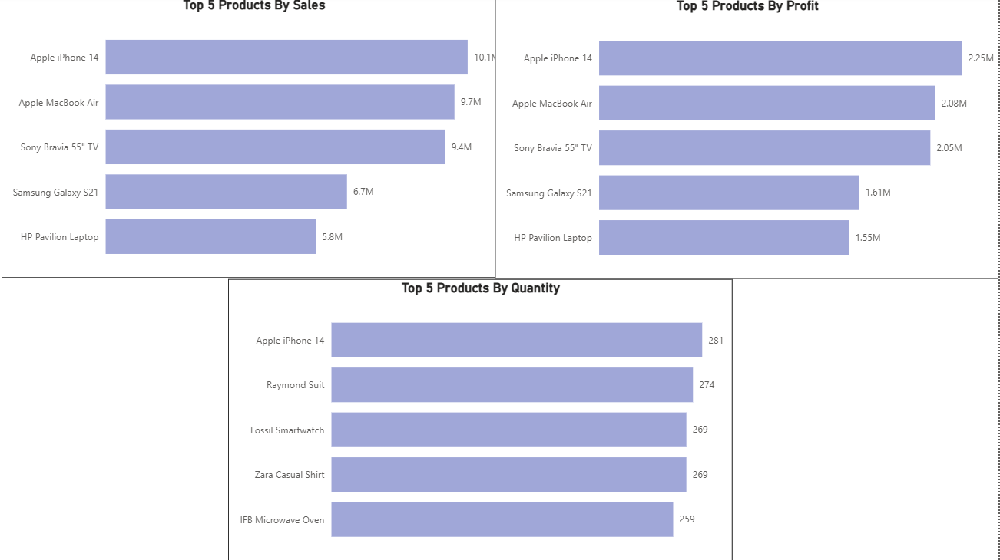
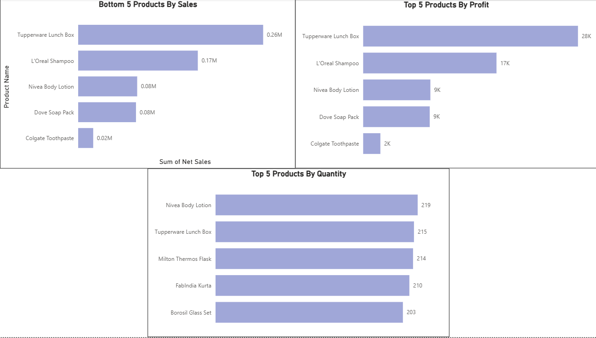
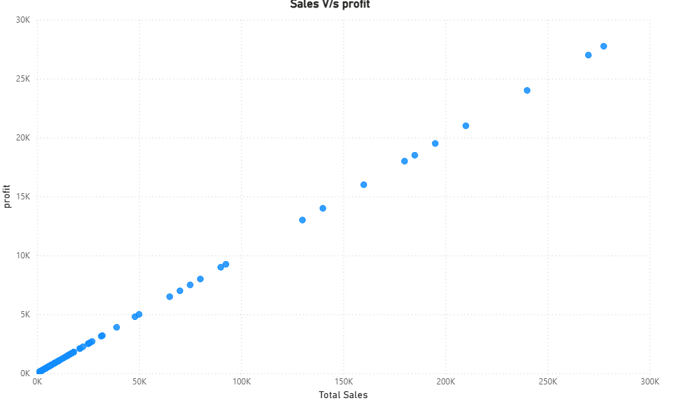
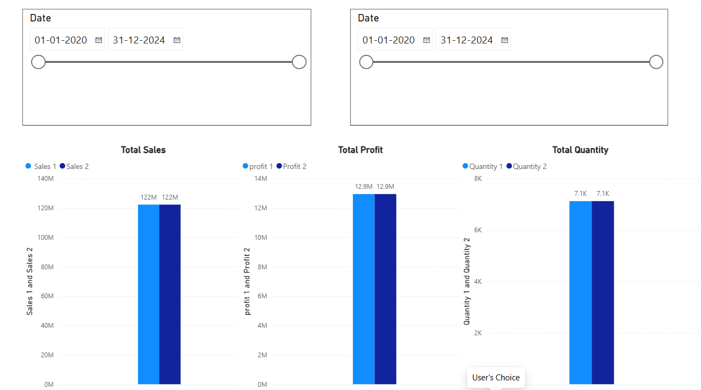

# Sales Performance & Profitability Analysis

## 📊 Project Overview

An interactive Power BI dashboard developed to analyze sales performance, product performance, profitability, order volume, discounting, and geographic sales distribution.

The project transforms transactional sales data into an interactive business intelligence report that allows users to explore performance across products, customers, promotions, cities, and time.

---

## 🎯 Project Objectives

The main objectives of this project were to:

- Analyze overall sales performance
- Identify top-performing products
- Identify low-performing products
- Compare product sales, quantity, and profitability
- Analyze sales performance over time
- Examine the relationship between sales and profit
- Analyze sales performance across cities
- Analyze discount levels
- Provide interactive filtering for exploratory analysis

---

## 🛠️ Tools & Technologies

- **Power BI**
- **DAX**
- **Power Query**
- **Data Modeling**
- **Data Visualization**
- **Interactive Dashboards**

---

## 🗂️ Data Model

The report uses a fact-and-dimension based data model consisting of:

- Fact Table
- Customer Dimension
- Product Dimension
- Promotion Dimension
- Date Table
- Measures Table

This structure allows the report to analyze business performance across different dimensions such as customers, products, promotions, and time.

---

## 📈 Dashboard Pages

### 1. Top 5 Products

Analyzes the five highest-performing products based on:

- Net Sales
- Profit
- Quantity

---

### 2. Bottom 5 Products

Identifies low-performing products based on key business metrics.

---

### 3. Sales vs Profit

Examines the relationship between sales and profitability using visual analysis.

---

### 4. Interactive Analysis

Provides interactive exploration of sales, profit, and quantity using filters for:

- Date
- Customer
- Product
- Promotion

---

## 📌 Key Metrics

The report includes analytical measures for:

- Net Sales
- Net Profit
- Net Quantity
- Total Orders
- Discount
- Price per Unit

---

## 🔍 Analysis Performed

The dashboard enables analysis of:

### Product Performance
Identification of products generating high and low levels of sales, profit, and quantity.

### Sales Performance
Analysis of sales performance across different time periods.

### Profitability
Comparison of sales and profit to understand product and business performance.

### Geographic Performance
Analysis of sales contribution across different cities.

### Discount Analysis
Evaluation of average discount levels across available categories.

### Interactive Exploration
Users can dynamically filter the report based on customer, product, promotion, and date.

---

## 💡 Key Skills Demonstrated

- Power BI dashboard development
- Data modeling
- DAX measures
- Interactive data visualization
- Sales analysis
- Profitability analysis
- Product performance analysis
- Time-series analysis
- Geographic analysis
- Business intelligence reporting

---

## 📁 Project Files

| File | Description |
| :--- | :--- |
| [`Sales_Performance_Profitability_Analysis.pbix`](./Sales_Performance_Profitability_Analysis.pbix) | Power BI report containing the data model, calculations, visual dashboard |
| [`screenshots/`](./screenshots/) | Screenshots of selected dashboard pages |

---

## 🚀 How to Use

1. Download the `.pbix` file from this repository.
2. Open it using **Microsoft Power BI Desktop**.
3. Explore the report pages and interact with the available filters and visuals.

---

## 📌 Disclaimer

This project was created for learning and portfolio purposes.
