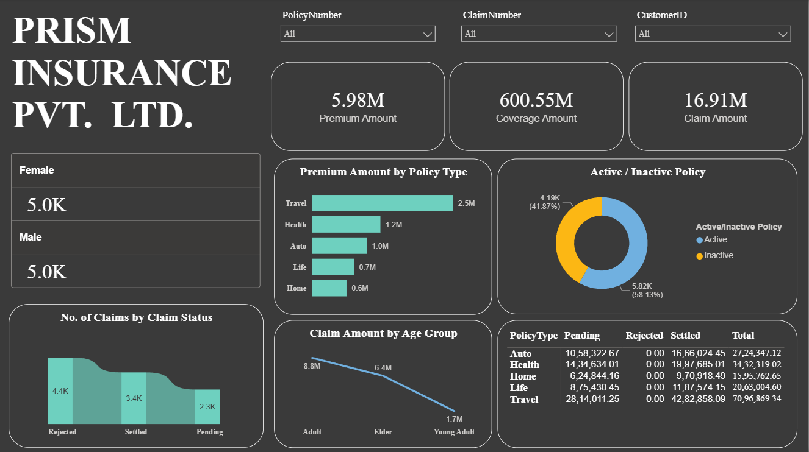

# Insurance Claims & Policy Analytics Dashboard

## 📊 Project Overview

An interactive Power BI dashboard developed to analyze insurance policies, premiums, coverage amounts, claims, customer demographics, and claim status.

The dashboard provides a consolidated view of insurance performance and enables users to explore policy and claim activity through interactive filters.

---

## 🎯 Project Objectives

The main objectives of this project were to:

- Analyze overall insurance policy performance
- Monitor total premium and coverage amounts
- Analyze insurance claim amounts
- Compare active and inactive policies
- Analyze claims by status
- Examine claim amounts across different age groups
- Analyze premium distribution across policy types
- Explore claim and policy performance by insurance category
- Enable interactive filtering of policy and customer information

---

## 🛠️ Tools & Technologies

- **Power BI**
- **DAX**
- **Data Modeling**
- **Data Visualization**
- **Interactive Dashboards**

---

## 📌 Key Performance Indicators

The dashboard provides high-level KPIs including:

| Metric | Value |
|---|---:|
| Premium Amount | 5.98M |
| Coverage Amount | 600.55M |
| Claim Amount | 16.91M |

These KPIs provide an overview of the overall insurance portfolio and claim activity represented in the dataset.

---

## 📈 Dashboard Analysis

### Policy Performance

The dashboard provides analysis of:

- Total policies
- Active policies
- Inactive policies
- Policy types
- Policy-level performance

### Claims Analysis

Claims are analyzed based on:

- Claim status
- Claim amount
- Age group
- Policy type
- Customer characteristics

### Premium & Coverage Analysis

The report provides analysis of:

- Premium amounts
- Coverage amounts
- Premium distribution by policy type
- Relationship between policy and claim information

---

## 🔎 Interactive Filters

Users can interact with the dashboard using filters including:

- Policy Number
- Claim Number
- Customer ID

These filters allow users to investigate individual policies, claims, and customers within the dataset.

---

## 🖼️ Dashboard

---

## 💡 Key Skills Demonstrated

- Power BI dashboard development
- Data visualization
- Interactive filtering
- Insurance data analysis
- KPI development
- Claims analysis
- Policy analysis
- Customer segmentation
- Data modeling
- Business intelligence reporting

---

## 📁 Project Files

| File | Description |
| :--- | :--- |
| [`Insurance_Claims_Policy_Analytics.pbix`](./Insurance_Claims_Policy_Analytics.pbix) | Power BI report containing the dashboard, data model, calculations, and visualizations |
| [`screenshots/insurance-dashboard.png`](./screenshots/insurance-dashboard.png) | Screenshot of the completed dashboard |
---

## 🚀 How to Use

1. Download the `.pbix` file from this repository.
2. Open it using **Microsoft Power BI Desktop**.
3. Explore the dashboard and interact with the available filters and visuals.

---

## 📌 Disclaimer

This project was created for learning and portfolio purposes.
