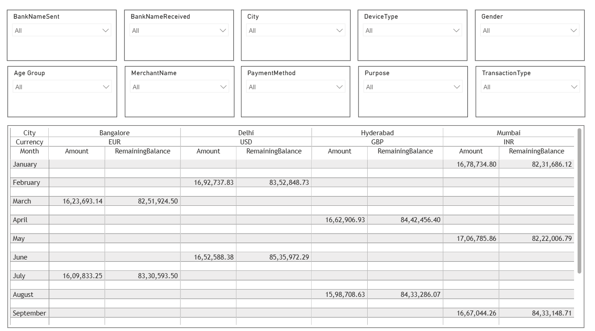
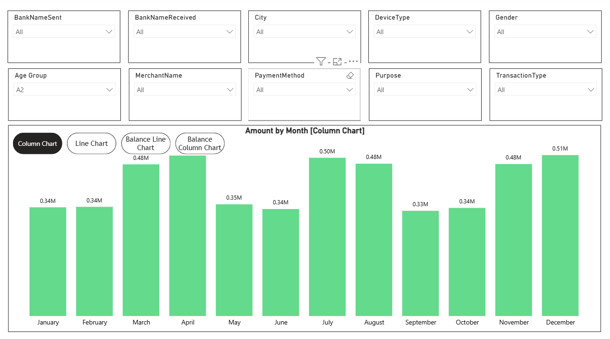

# Banking Transaction Analysis Dashboard

## 📊 Project Overview

An interactive Power BI dashboard developed to analyze banking transaction activity, transaction amounts, remaining balances, and customer and transaction characteristics.

The report provides both detailed transaction-level analysis and interactive monthly transaction analysis across multiple banking and customer dimensions.

---

## 🎯 Project Objectives

The main objectives of this project were to:

- Analyze banking transaction activity
- Examine transaction amounts across different months
- Analyze remaining account balances
- Compare transaction activity across cities
- Analyze transactions by bank
- Explore transaction behavior across customer demographics
- Analyze transactions by device type
- Examine payment methods and transaction purposes
- Analyze transaction types
- Provide interactive filtering for exploratory analysis

---

## 🛠️ Tools & Technologies

- **Power BI**
- **DAX**
- **Data Modeling**
- **Data Visualization**
- **Interactive Dashboards**

---

## 📈 Dashboard Pages

### 1. Transaction & Balance Analysis

The first page provides detailed transaction-level analysis, including:

- City
- Currency
- Monthly transaction amount
- Remaining balance

This view allows users to examine transaction and balance information across different locations and currencies.

---

### 2. Monthly Transaction Analysis

The second page provides interactive visual analysis of transaction activity and balances over time.

Key visualizations include:

- Amount by Month
- Monthly transaction trends
- Balance trends
- Transaction amount comparisons

---

## 🔎 Interactive Filters

The dashboard provides multiple filters that allow users to explore transaction behavior across different dimensions.

Available filters include:

- Bank Name Sent
- Bank Name Received
- City
- Device Type
- Gender
- Age Group
- Merchant Name
- Payment Method
- Purpose
- Transaction Type

These filters allow users to dynamically analyze different segments of the transaction dataset.

---

## 📌 Analysis Areas

### Transaction Analysis

Examines transaction amounts across different periods, locations, and transaction categories.

### Balance Analysis

Analyzes remaining balances and their variation across the available transaction data.

### Customer Demographics

Allows transaction activity to be explored across:

- Gender
- Age Group
- City

### Transaction Characteristics

Provides analysis based on:

- Payment Method
- Device Type
- Merchant
- Purpose
- Transaction Type

### Banking Analysis

Allows users to investigate transaction activity based on the sending and receiving banks.

---

## 💡 Key Skills Demonstrated

- Power BI dashboard development
- Data visualization
- Interactive filtering
- Financial transaction analysis
- Time-series analysis
- Customer segmentation
- Geographic analysis
- Data modeling
- Business intelligence reporting

---

## 📁 Project Files

| File | Description |
|---|---|
| [`Banking_Transaction_Analysis.pbix`](./Banking_Transaction_Analysis.pbix) | Power BI report containing the data model, calculations, visuals, and interactive dashboards |
| [`screenshots/`](./screenshots/) | Screenshots of the dashboard pages |

---

## 🚀 How to Use

1. Download the `.pbix` file from this repository.
2. Open it using **Microsoft Power BI Desktop**.
3. Explore both report pages.
4. Use the available filters to analyze different transaction segments.

---

## 📌 Disclaimer

This project was created for learning and portfolio purposes.
