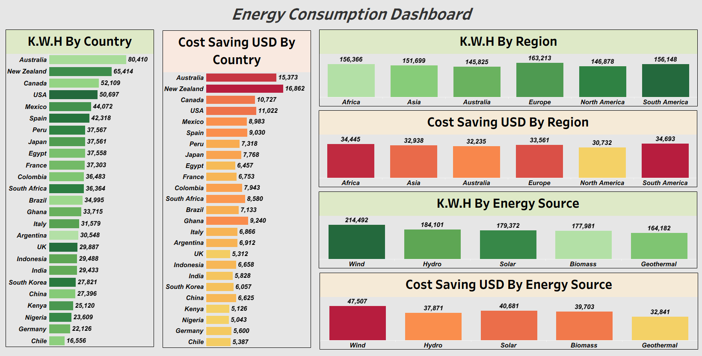
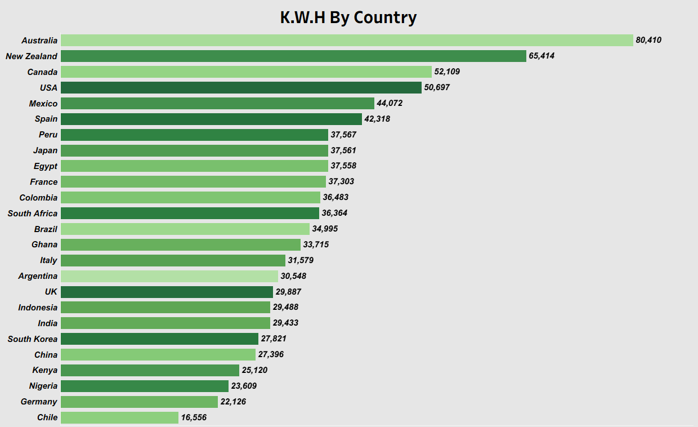
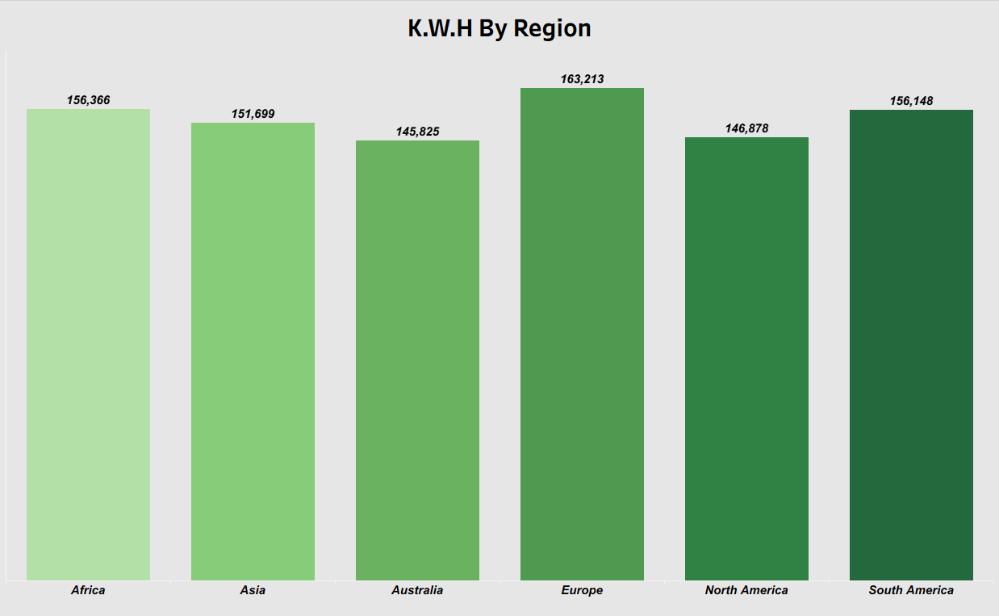
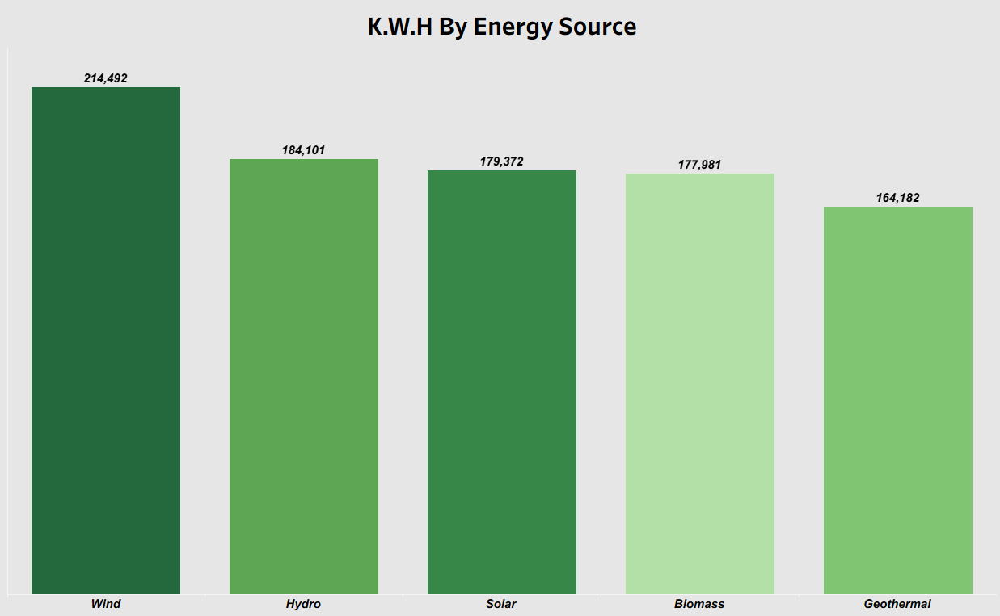
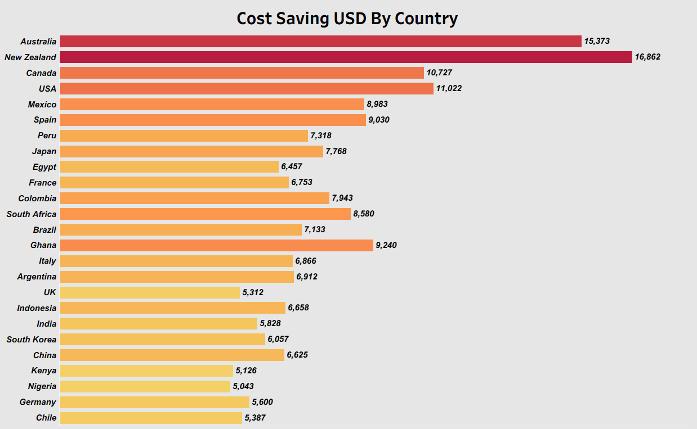
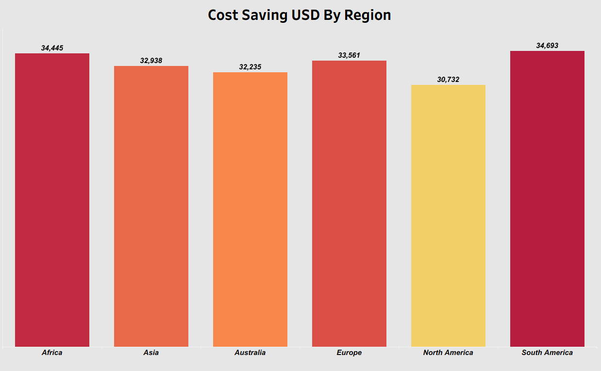
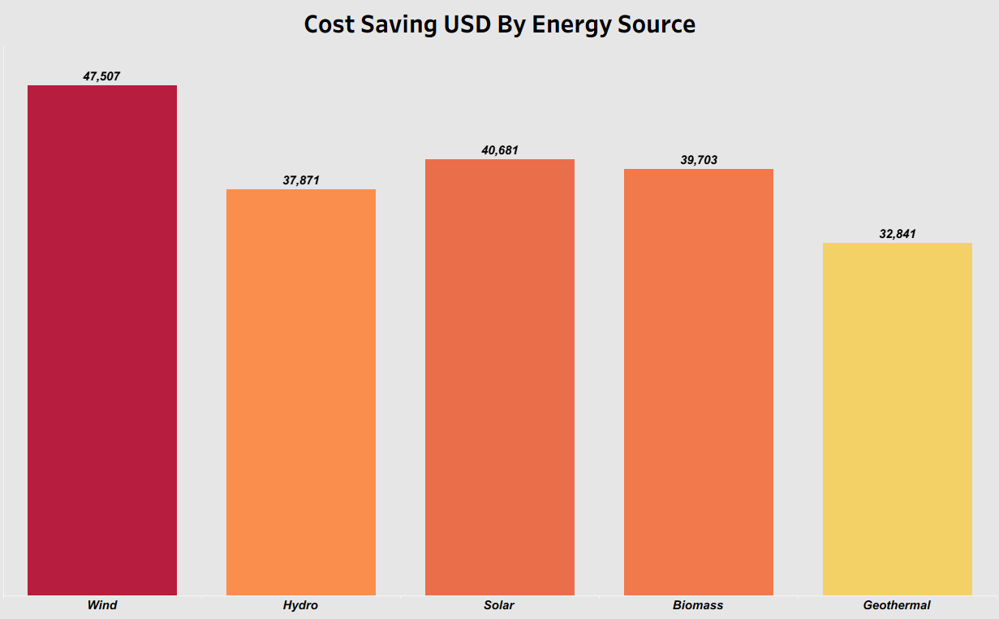

# Renewable Energy Consumption Analysis (AWS + Snowflake + Tableau)

An end-to-end analytics project analyzing household-level renewable energy adoption, consumption, and cost savings — built on an AWS S3 → Snowflake → Tableau pipeline.

## Overview

This project explores a household energy usage dataset to understand how renewable energy adoption translates into cost savings, and how usage patterns vary geographically and by energy source. Raw data was stored in AWS S3, made accessible to Snowflake via an IAM role/storage integration, loaded into Snowflake with SQL, and visualized in Tableau through a live connection. The final workbook includes six analytical worksheets and one consolidated dashboard comparing **Cost Savings (USD)** and **Monthly Usage (kWh)** across Country, Region, and Energy Source.

## Architecture

```
AWS S3 (raw data storage)
      │
      ▼
IAM Role (grants Snowflake secure, read access to the S3 bucket)
      │
      ▼
Snowflake (SQL used to load/stage the data as a table: RENEWABLE_ENERGY_USAGE)
      │
      ▼
Tableau (live connection to Snowflake for visualization)
```

1. **AWS S3** — raw energy usage data was stored in an S3 bucket.
2. **IAM Role** — an IAM role was created to grant Snowflake secure access to that S3 bucket (storage integration), without exposing static credentials.
3. **Snowflake** — SQL was used to load the S3 data into the `TABLEAU_DB.TABLEAU_SCHEMA.RENEWABLE_ENERGY_USAGE` table, which serves as the analytical data source.
4. **Tableau** — connects live to Snowflake and powers all worksheets and the dashboard.

## Data Source

- **Warehouse:** Snowflake (`TABLEAU_DB.TABLEAU_SCHEMA.RENEWABLE_ENERGY_USAGE`), loaded from AWS S3
- **Granularity:** One row per household, per year
- **Key fields:**

  | Field | Description |
  |---|---|
  | `HOUSEHOLD_ID` | Unique household identifier |
  | `COUNTRY` / `REGION` | Household location |
  | `URBAN_RURAL` | Urban or rural classification |
  | `HOUSEHOLD_SIZE` | Number of people in the household |
  | `INCOME_LEVEL` | Household income bracket |
  | `ENERGY_SOURCE` | Type of energy used (e.g., solar, wind, hydro, biomass, geothermal) |
  | `ADOPTION_YEAR` | Year the household adopted the energy source |
  | `YEAR` | Reporting year for the usage record |
  | `MONTHLY_USAGE_KWH` | Average monthly energy consumption (kWh) |
  | `COST_SAVINGS_USD` | Estimated monthly cost savings (USD) |
  | `SUBSIDY_RECEIVED` | Whether the household received a subsidy |

> **Note:** The workbook connects live to Snowflake. To open it yourself, you'll need valid Snowflake credentials for an instance with a matching `RENEWABLE_ENERGY_USAGE` table, or you can redirect the connection to your own data source with the same schema.

## Dashboard



## Worksheets

| Worksheet | Preview | What it shows |
|---|---|---|
| `KWH By Country` |  | Total monthly energy usage, broken down by country |
| `KWH By Region` |  | Total monthly energy usage, broken down by region |
| `KWH By Energy Source` |  | Monthly usage compared across energy source types |
| `CSU By Country` |  | Cost savings (USD), broken down by country |
| `CSU By Region` |  | Cost savings (USD), broken down by region |
| `CSU By Energy Source` |  | Cost savings (USD) compared across energy source types |

## How to Use

1. Install [Tableau Desktop](https://www.tableau.com/products/desktop) (or use Tableau Public/Reader as applicable).
2. Open [`energy_consumption.twb`](./energy_consumption.twb).
3. When prompted, connect to a Snowflake instance with the `RENEWABLE_ENERGY_USAGE` table (matching the schema above), or edit the data source connection to point to your own copy of the dataset.
4. Explore the worksheets and dashboard to compare usage and savings across countries, regions, and energy sources.

## Tools Used

- **AWS S3** — raw data storage
- **AWS IAM** — role-based, credential-free access from Snowflake to S3
- **Snowflake** — cloud data warehouse and SQL-based data loading
- **Tableau Desktop** — visualization and dashboarding

## Author

Aunsuman Sahu

## License

Feel free to fork or reference this project for learning purposes. If you reuse the analysis approach, a credit/link back is appreciated.

