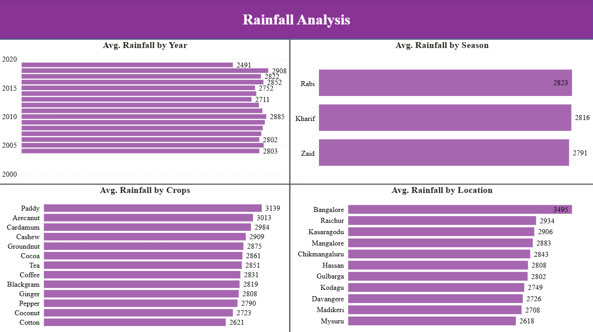
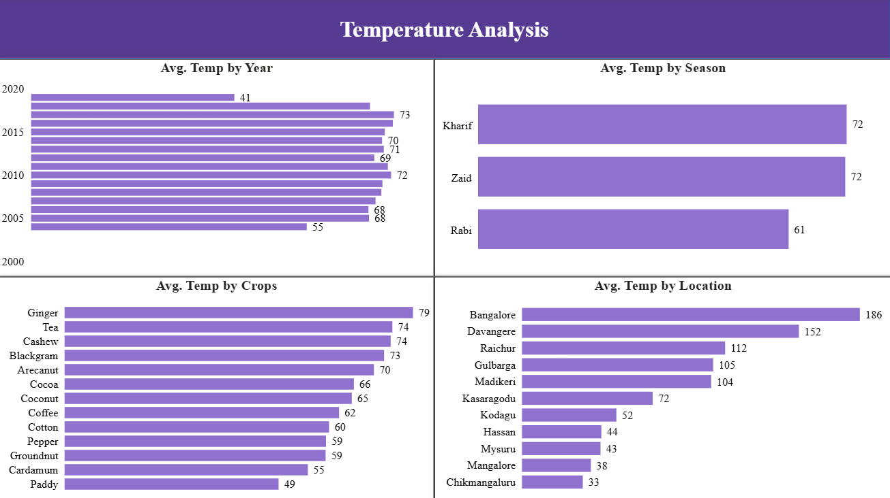
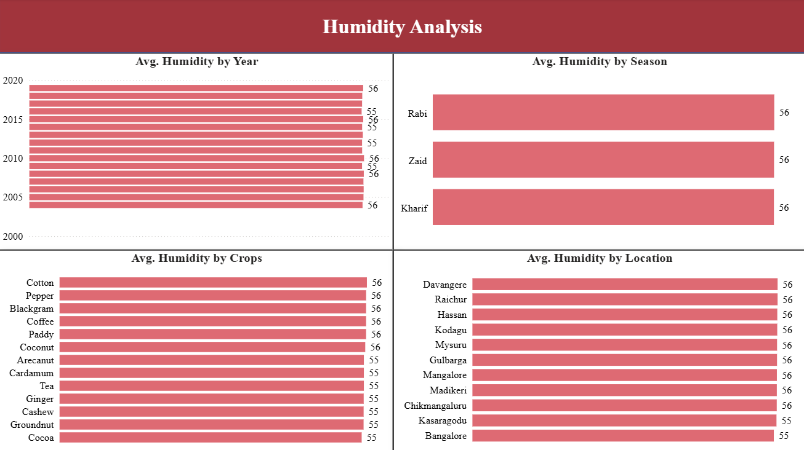
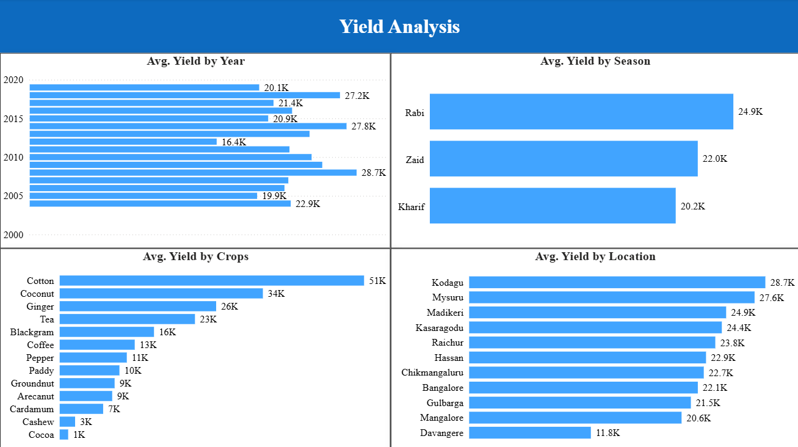

# 🌾 Agriculture Analysis (AWS + Snowflake + Power BI)

An end-to-end analytics project analyzing agricultural and environmental indicators across **years, seasons, crops, and locations**, built on an **AWS S3 → Snowflake → Power BI** data pipeline.

## Overview

This project explores agricultural data to understand how environmental conditions and crop yield vary across different years, seasons, crops, and locations. Raw data was stored in **AWS S3**, made accessible to **Snowflake** through an **AWS IAM role/storage integration**, loaded into Snowflake using **SQL**, and then used as the analytical data source for **Power BI** visualization.

The final Power BI report contains four analytical pages covering **Rainfall, Temperature, Humidity, and Yield**.

## Architecture

```
AWS S3 (raw data storage)
      │
      ▼
IAM Role (grants Snowflake secure, read access to the S3 bucket)
      │
      ▼
Snowflake (SQL used to load/stage the data)
      │
      ▼
Power BI (visualization and dashboarding)
```

1. **AWS S3** — raw agricultural data was stored in an S3 bucket.
2. **IAM Role** — an IAM role was used to grant Snowflake secure access to the S3 bucket through a storage integration.
3. **Snowflake** — SQL was used to load and prepare the data in Snowflake for analytical use.
4. **Power BI** — connects to the Snowflake data source and provides the visualization and dashboard layer.

## Data Source

- **Data warehouse:** Snowflake, with source data loaded from AWS S3
- **Analytical layer:** Snowflake
- **Visualization layer:** Power BI
- **Key analytical dimensions:** Year, Season, Crop, Location
- **Key measures/indicators:** Rainfall, Temperature, Humidity, and Yield

> **Note:** The project follows the same AWS S3 → IAM → Snowflake workflow used in the renewable energy analytics project, with Power BI replacing Tableau as the visualization layer.

## Dashboard Pages

### 1. Rainfall Analysis

Analyzes average rainfall patterns across years, seasons, crops, and locations.



### 2. Temperature Analysis

Compares average temperature across years, seasons, crops, and locations.



### 3. Humidity Analysis

Analyzes average humidity across years, seasons, crops, and locations.



### 4. Yield Analysis

Analyzes average agricultural yield across years, seasons, crops, and locations.



## Key Analytical Dimensions

- Year
- Season
- Crop
- Location
- Rainfall
- Temperature
- Humidity
- Yield

## How to Use

1. Open the Power BI report.
2. Ensure the Snowflake data source is available and the connection is configured for the relevant environment.
3. Explore the four analytical pages to compare agricultural and environmental patterns across years, seasons, crops, and locations.

## Tools Used

- **AWS S3** — raw data storage
- **AWS IAM** — role-based access for Snowflake to S3
- **Snowflake** — cloud data warehouse and SQL-based data loading
- **SQL** — data loading/preparation
- **Power BI** — visualization and dashboarding

## Project Files

- [Power BI Dashboard](./Agriculture%20Analysis.pbix)
- [Dashboard Screenshots](./screenshots/)

## Purpose

This project demonstrates an end-to-end cloud analytics workflow using **AWS S3, AWS IAM, Snowflake, SQL, and Power BI**, combining cloud data storage and warehousing with interactive agricultural and environmental analysis.
