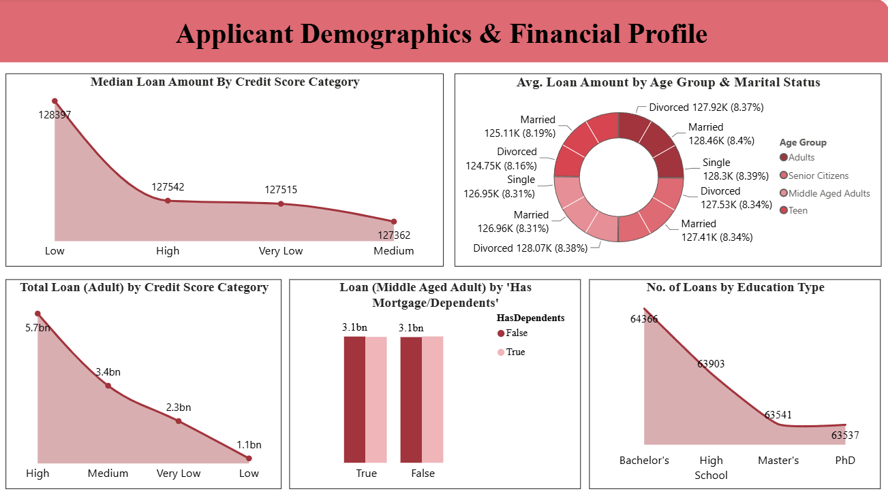
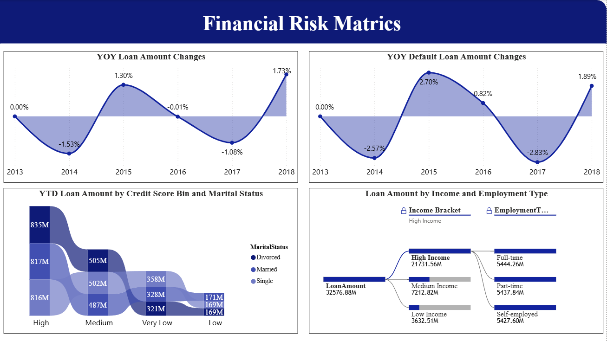
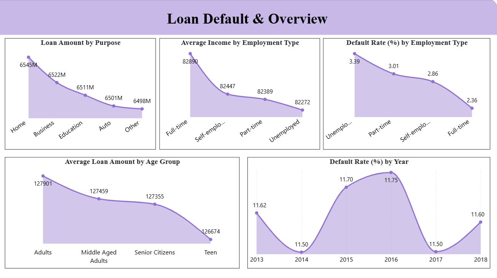

# 💳 Loan Analysis

A Power BI dashboard project analyzing applicant financial profiles, credit risk indicators, and loan default patterns across demographic and time-based dimensions.

## Project Overview

This project uses Power BI to explore loan applicant characteristics and financial risk, with a focus on credit scores, loan amounts, default rates, and changes in loan and default activity over time.

The dashboard contains three analysis pages:

- **Applicant Demographics & Financial Profile** — analyzes applicant characteristics and financial measures such as age, credit score, and loan amount
- **Financial Risk Metrics** — examines credit-score distributions, risk-related measures, and financial characteristics
- **Loan Default Overview** — analyzes loan defaults, default rates, and changes in loan/default activity across years

## Dashboard Pages

### 1. Applicant Demographics & Financial Profile

Analyzes applicant and financial characteristics using dimensions such as age, credit score, and loan amount.

### 2. Financial Risk Metrics

Provides analysis of financial risk indicators, including credit-score ranges and loan-related measures.

### 3. Loan Default Overview

Analyzes loan default activity and default rates across available years and applicant segments, including year-over-year changes in loan and default activity.

## Key Analytical Areas

- Applicant demographics
- Credit score analysis
- Loan amount analysis
- Credit-score bin analysis
- Default rate analysis
- Age-group analysis
- Year-based analysis
- Loan and default year-over-year changes

## Tools

- Power BI
- Data Visualization
- Exploratory Data Analysis

## Project Files

- [Power BI Dashboard](./loan.pbix)
- [Dashboard Screenshots](./screenshots/)

## Purpose

This project demonstrates the use of Power BI to analyze lending-related data through interactive visualizations, financial risk indicators, applicant segmentation, and loan default analysis.
