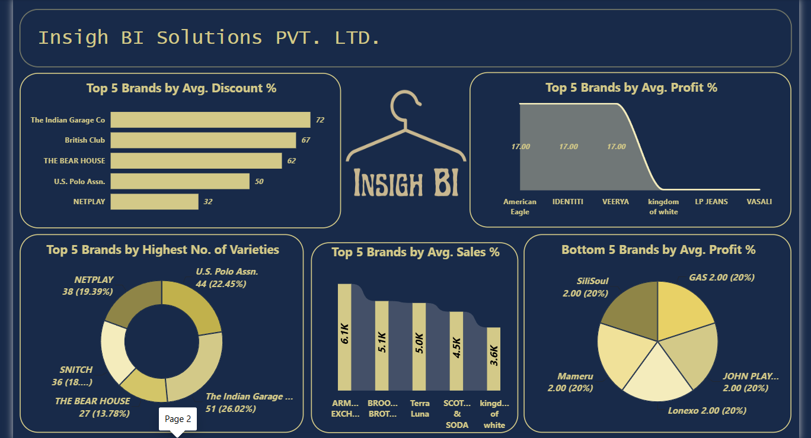

# 👕 Men's T-shirt Analysis

A Power BI dashboard project analyzing men's T-shirt brands across discount, profit, sales, and product variety metrics.

## Project Overview

This project uses Power BI to explore brand-level performance within a men's T-shirt dataset. The dashboard focuses on comparing brands by average discount, average profit, average sales, and number of product varieties.

The dashboard contains two pages:

- **Brand Selection** — provides a brand-level selection interface for exploring the dataset
- **Brand Performance Dashboard** — compares top and bottom brands across discount, profit, sales, and product variety metrics

## Dashboard Pages

### 1. Brand Selection

Provides a visual brand-selection interface for navigating and exploring different men's T-shirt brands.

### 2. Brand Performance Dashboard

Provides comparative analysis of brands using:

- Top 5 brands by average discount %
- Top 5 brands by average profit %
- Top 5 brands by number of product varieties
- Top 5 brands by average sales %
- Bottom 5 brands by average profit %

## Key Analytical Areas

- Brand performance comparison
- Average discount analysis
- Average profit analysis
- Average sales analysis
- Product variety analysis
- Top and bottom brand analysis

## Tools

- Power BI
- Data Visualization
- Exploratory Data Analysis

## Project Files

- [Power BI Dashboard](./Men%2BTshirt.pbix)
- [Dashboard Screenshots](./screenshots/)

## Purpose

This project demonstrates the use of Power BI to compare men's T-shirt brands using sales, profit, discount, and product variety metrics through interactive visualizations.
