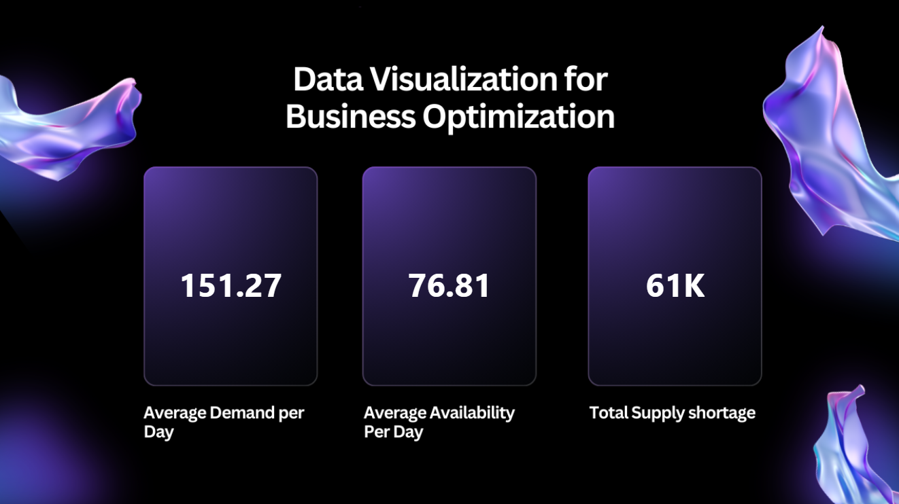
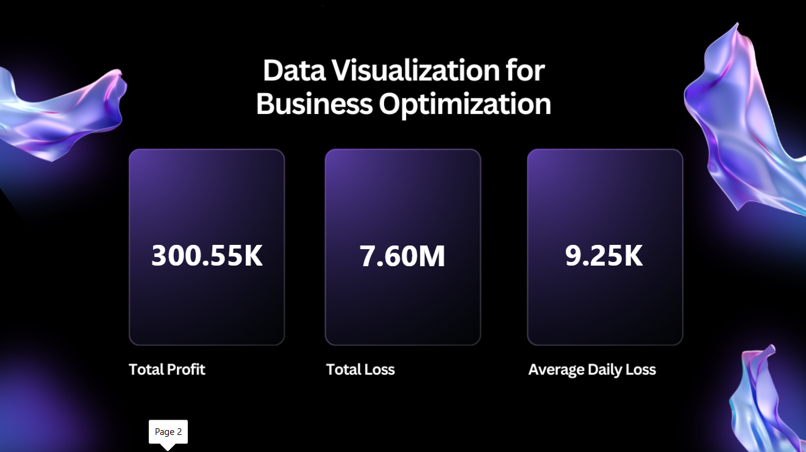

# 📦 Demand & Availability Analysis

A Power BI dashboard project analyzing demand, availability, supply shortages, profit, and loss metrics to support business optimization.

## Project Overview

This project uses Power BI to visualize demand and supply conditions alongside profitability and loss metrics. The dashboard presents key measures for understanding demand levels, product availability, supply shortages, and financial performance.

The dashboard contains two analysis pages:

- **Demand, Availability & Supply Shortage** — presents average daily demand, average daily availability, and total supply shortage
- **Profit & Loss Analysis** — presents total profit, total loss, and average daily loss

## Dashboard Pages

### 1. Demand, Availability & Supply Shortage

Highlights key supply and demand measures:

- Average Demand per Day
- Average Availability per Day
- Total Supply Shortage

### 2. Profit & Loss Analysis

Summarizes financial performance using:

- Total Profit
- Total Loss
- Average Daily Loss

## Key Analytical Areas

- Demand analysis
- Availability analysis
- Supply shortage analysis
- Profit analysis
- Loss analysis
- Daily loss analysis
- Business performance monitoring

## Tools

- Power BI
- Data Visualization
- Exploratory Data Analysis

## Project Files

- [Power BI Dashboard](./Demand%26Availability%20Data.pbix)
- [Dashboard Screenshots](./screenshots/)

## Purpose

This project demonstrates the use of Power BI to present demand, availability, supply shortage, profit, and loss metrics in a concise business-focused dashboard.
